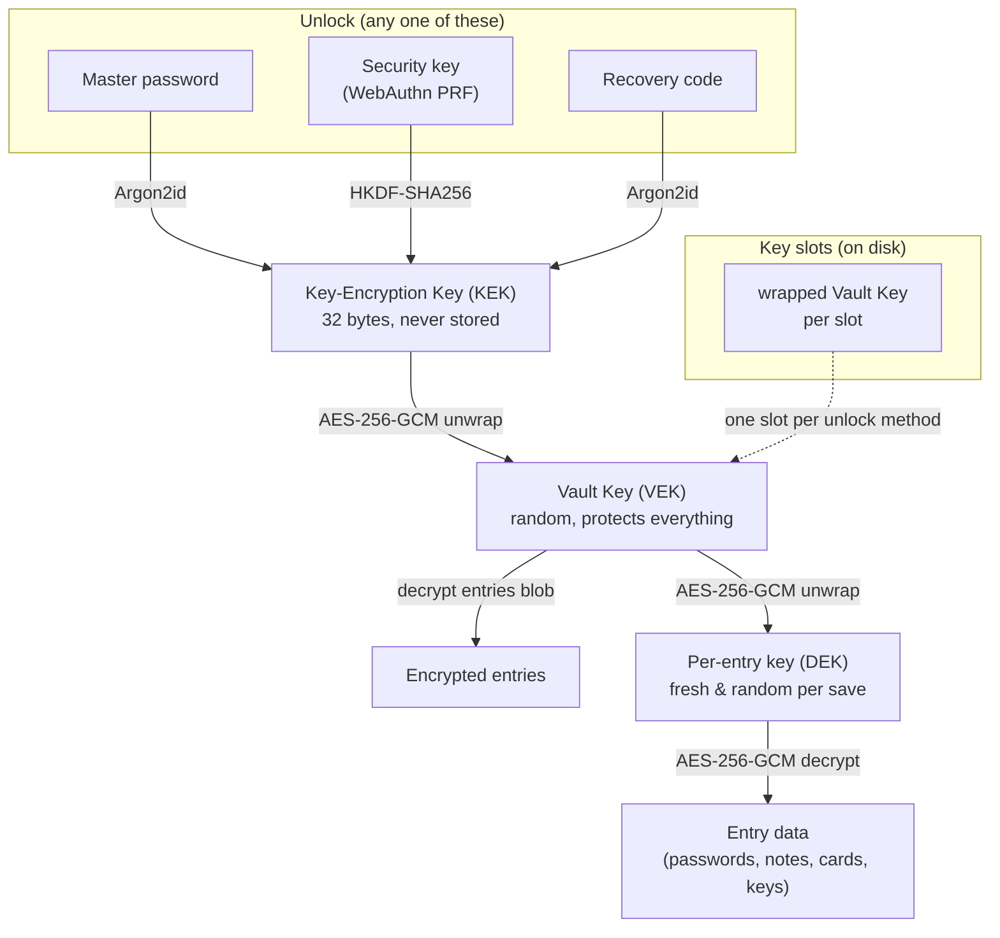

# Bramble

A password manager that lives in your browser and keeps your secrets on your own machine. No account, no server holding your vault, no company to get breached and leak everything. You hold the file, you hold the password, and that's it.

Bramble is a Chromium extension (Chrome, Edge, Brave, Arc, and friends). Install it and you're up and running in a minute.

> **Get it from the Chrome Web Store.** (Listing link coming soon.)

## What it does

Your passwords are encrypted on your device and written to a single vault file, wherever you choose to put it. Drop it in a Dropbox or Google Drive folder and it syncs across your machines. Bramble never sees that folder, it just reads and writes one encrypted blob.

Everything cryptographic happens inside a Rust module compiled to WebAssembly. Your master password never touches the JavaScript heap.

## Features

- **🔒 Local-first, always.** One encrypted file on disk, in a location you pick.
- **No shortcuts on crypto.** Argon2id for your key, AES-256-GCM for the data, envelope encryption so every entry has its own key. Secrets get wiped from memory after use.
- **Everything is encrypted.** Site names, usernames, notes, all of it. The only readable thing on disk is the file header.
- **🎯 Domain-smart autofill.** `www.ikea.com`, `ca.accounts.ikea.com`, and `ikea.com` all match the same login. One entry, several URLs.
- **More than logins.** Logins, payment cards, secure notes, and SSH keys, each with their own fields.
- **Built-in password generator.** Strong passwords on tap.
- **🔑 Unlock with a hardware key.** Register a YubiKey, Touch ID, or Windows Hello and unlock with a tap via the WebAuthn PRF extension. The key never hands over its secret. Use it alongside your master password, or turn the password off and make the key your only way in.
- **Recovery codes.** Every vault gets a high-entropy recovery code at setup: a printable backup that unlocks it independently of your master password. Shown once, stored offline, never kept in plaintext. Reset it any time.
- **TOTP / 2FA codes.** Paste an `otpauth://` URI or bare secret and Bramble generates the six-digit codes.
- **Breach checking.** Optional Have I Been Pwned lookup using k-anonymity, so nothing about your password leaves your machine.
- **Auto-lock.** Locks after 15 minutes idle by default (configurable).
- **Import from KeePass.** Bring your KDBX4 database over, key files included.
- **Multi-key vaults.** LUKS-style key slots, so your master password, a security key, or your recovery code can each unlock the same vault.

## Why this beats the cloud managers

The cloud guys keep everyone's vaults on their servers, one giant target. When one gets popped it's not your vault that leaks, it's millions at once, and you find out from a blog post months later. Looking at you, LastPass and Dashlane 👀

Bramble flips that around:

- **No server to breach.** Your vault never leaves your control. No central pile of data for anyone to go after.
- **No account, no subscription, no telemetry.** Nothing to sign up for, nothing phoning home.
- **You own the file.** Back it up, sync it, or keep it off the internet entirely. Your call.
- **Nothing to trust but the code.** The crypto is open and runs entirely on your device. You're not taking anyone's word that the server "can't read your data."

The tradeoff is real and worth being honest about: there's no "I forgot my password" button on a server somewhere. But you're not without a safety net: every vault gets a recovery code, and you can register a hardware key as another way in. Save the recovery code and back up your vault file. Lose *all* of them (password, key, and recovery code) and the vault is gone, because nobody else holds a copy.

## How the encryption works

Bramble uses LUKS-style key slots and envelope encryption. There's one random **Vault Key (VEK)** that actually protects your data. Each way of unlocking (master password, security key, or recovery code) derives its own **Key-Encryption Key (KEK)** that unwraps a copy of that same Vault Key, so adding or revoking an unlock method never re-encrypts a single entry. The Vault Key then unwraps a fresh per-entry key for every item, and that key decrypts the entry itself. Everything is AES-256-GCM, all of it inside the Rust/WASM module.



Your master password never leaves the WASM module, and the KEK and decrypted keys are wiped from memory after use. On disk, only the file header is readable, everything else is ciphertext.

## How it stacks up against KeePass

If you love KeePass, you'll feel at home: your encrypted database, your control, no cloud middleman. Bramble even imports your KDBX4 files. Where it's different:

- **🌐 It lives in your browser.** No separate desktop app, no plugin talking to a local program. Install the extension and you're done.
- **Autofill just works.** Domain matching and an on-page dropdown, built in rather than bolted on.
- **One opinionated, modern build** instead of a sprawl of plugins and forks. Argon2id and AES-256-GCM out of the box.
- **Modern UI.** KeePass looks like it escaped from 2003 (no disrespect). Bramble is clean and fast, with dark mode and a layout that won't make you wince.

The KeePass philosophy with a browser-native coat of paint and autofill that works smoothly.

## AI usage disclosure

Parts of Bramble were written with AI assistance (Claude Opus 4.7), but every line was directed, reviewed, and shaped by a software engineer with over a decade of experience, the security-critical pieces especially. The AI was a fast typist, not the architect. The codebase is heavily tested, automated and manual, because for security software "it seems to work" isn't good enough.

## What's coming next

- **Passkey storage.** Bramble will create, store, and serve passkeys, acting as your own WebAuthn authenticator.
- **Smarter autofill.** More form-detection coverage and fixes for the weird checkout and login pages that like to break things.

Further out for v2: Firefox and Safari, mobile, file attachments, and iframe/shadow-DOM autofill.

## Status

Early days, but the core is real and working. v1 targets Chromium browsers (MV3). Firefox is on the roadmap. Found a bug or have an idea? Open an issue.

## Contributing

Open source and contributions welcome. A few things worth knowing:

- **Open an issue first for anything big.** Bug reports and small fixes can go straight to a PR.
- **Security software has a higher bar.** Expect changes to come with tests, and the crypto and vault-format paths to get extra scrutiny.
- **Found a security issue?** Please don't file it in the public tracker. Report it privately so it can be fixed before it's out in the open. (Email: flythenimbus@pm.me)

PRs that add real-site autofill fixtures or import-format coverage are especially handy.

## Support

Bramble is free and open source. If it's useful to you, toss some Monero our way. 💜

<p align="center">
  
</p>

```
4AC3txuTwFm4fkamoYeK47c9EpnPwbreHNxJeKDYHiDNN6weD5vVA4BCH1azQhSxa6JjereuVpt21Pu2MyRDFDNNH6KGnWq
```

## License

Bramble is free software, released under the GNU General Public License v3.0. See the [LICENSE](LICENSE) file for the full text. In short: use it, study it, fork it, and share it. If you distribute a modified version, pass the same freedoms along and make your source available under the GPLv3 too.
